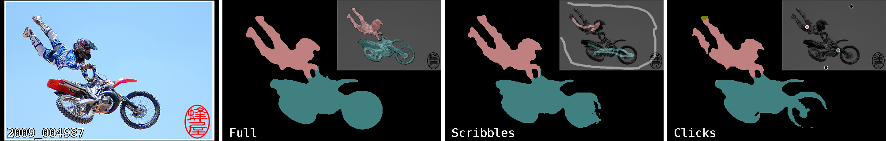

### Gated CRF Loss for Weakly Supervised Semantic Image Segmentation 

This repository provides a PyTorch implementation of the method described in the paper 
Gated CRF Loss for Weakly Supervised Semantic Image Segmentation.


 
Left to right: original image from Pascal VOC validation set, and semantic segmentation predictions, made by models trained with full, 
scribbles, and clicks supervision respectively. The proposed Gated CRF loss is a step towards bridging the gap between 
weak and full supervision. 
 
### Description   
The main components are:
- The proposed loss function, implemented as `torch.nn.Module`;
- Pascal VOC dataset loader extended with extra modalities for weak supervision - 
clicks and scribbles;
- CityScapes dataset loader extended with synthetic clicks;
- DeepLab v3+ with ResNet backbones as a dense prediction model; 
- Training code based on `pytorch-lightning` framework.

### Installation and Datasets
First, clone this repository:   
```bash
git clone https://github.com/toshas/GatedCRFLoss   
cd GatedCRFLoss 
```

Create and activate a new virtual environment, and install dependencies into it:
```bash
python -m venv ~/<envname>
source ~/<envname>/bin/activate
pip install .
```

Pascal VOC dataset and its other modalities are downloaded for the first time and reused later, 
which is handled by `torchvision`. The command line argument `dataset_root` should tell where to store dataset 
if `dataset_download` argument is specified, or where to look for it otherwise.

Experiments with CityScapes dataset require setting `dataset_root` to a root directory containing a manually 
downloaded copy of the dataset.

All weak annotations for both datasets are provided and looked for in the `datasets` directory of this repository.

### Usage

To train the model use the following command line template:
 ```bash
CUDA_VISIBLE_DEVICES=<gpu_ids> python scripts/train.py <arguments>    
```

Example:
```bash
CUDA_VISIBLE_DEVICES=0 ./scripts/train.py 
    --aug_input_crop_size 256 
    --aug_geom_validation_center_crop_sts True
    --batch_size 48 
    --datasets_dir /tmp/voc 
    --dataset voc 
    --log_dir . 
    --loss_cross_entropy_class_weights_sts True 
    --loss_cross_entropy_modality semseg_clicks 
    --loss_gatedcrf_sts True 
    --loss_gatedcrf_resolution 64 
```

### Command Line Arguments

```text
usage: train.py [-h] 
                --log_dir LOG_DIR 
                --datasets_dir DATASETS_DIR 
                --dataset {voc,cs} 
                [--dataset_download DATASET_DOWNLOAD]
                [--workers WORKERS] 
                [--workers_validation WORKERS_VALIDATION]
                [--num_batches_train_total NUM_BATCHES_TRAIN_TOTAL]
                [--num_batches_validation_step NUM_BATCHES_VALIDATION_STEP]
                --batch_size BATCH_SIZE
                [--batch_size_validation BATCH_SIZE_VALIDATION]
                --aug_input_crop_size AUG_INPUT_CROP_SIZE
                [--aug_geom_scale_min AUG_GEOM_SCALE_MIN]
                [--aug_geom_scale_max AUG_GEOM_SCALE_MAX]
                [--aug_geom_tilt_max_deg AUG_GEOM_TILT_MAX_DEG]
                [--aug_geom_wiggle_max_ratio AUG_GEOM_WIGGLE_MAX_RATIO]
                [--aug_geom_reflect AUG_GEOM_REFLECT]
                --aug_geom_validation_center_crop_sts AUG_GEOM_VALIDATION_CENTER_CROP_STS
                [--aug_geom_validation_center_crop_size AUG_GEOM_VALIDATION_CENTER_CROP_SIZE]
                [--aug_semseg_weak_stroke_width AUG_SEMSEG_WEAK_STROKE_WIDTH]
                [--optimizer {sgd,adam}] 
                [--optimizer_kwargs OPTIMIZER_KWARGS]
                [--lr_scheduler {poly}]
                [--lr_scheduler_power LR_SCHEDULER_POWER]
                [--model_name {deeplabv3p}]
                [--model_encoder_name {resnet34,resnet50,resnet101}]
                --loss_cross_entropy_class_weights_sts LOSS_CROSS_ENTROPY_CLASS_WEIGHTS_STS
                --loss_cross_entropy_modality {semseg_dense,semseg_scribbles,semseg_clicks}
                [--loss_cross_entropy_weight LOSS_CROSS_ENTROPY_WEIGHT]
                --loss_gatedcrf_sts LOSS_GATEDCRF_STS
                --loss_gatedcrf_resolution LOSS_GATEDCRF_RESOLUTION
                [--loss_gatedcrf_radius LOSS_GATEDCRF_RADIUS]
                [--loss_gatedcrf_kernels_desc LOSS_GATEDCRF_KERNELS_DESC]
                [--loss_gatedcrf_weight LOSS_GATEDCRF_WEIGHT]
                [--loss_gatedcrf_use_after_progress_ratio LOSS_GATEDCRF_USE_AFTER_PROGRESS_RATIO]
                [--num_batches_visualization_first NUM_BATCHES_VISUALIZATION_FIRST]
                [--num_batches_visualization_step NUM_BATCHES_VISUALIZATION_STEP]
                [--visualize_num_samples_in_batch VISUALIZE_NUM_SAMPLES_IN_BATCH]
                [--observe_train_ids OBSERVE_TRAIN_IDS]
                [--observe_valid_ids OBSERVE_VALID_IDS]
                [--tensorboard_img_grid_width TENSORBOARD_IMG_GRID_WIDTH]

optional arguments:
  -h, --help            show this help message and exit
  --log_dir LOG_DIR     Place for artifacts and logs (default: .)
  --datasets_dir DATASETS_DIR
                        Path to dataset (default: None)
  --dataset {voc,cs}    Pascal VOC or CityScapes (default: None)
  --dataset_download DATASET_DOWNLOAD
                        Download dataset if possible (default: False)
  --workers WORKERS     Number of worker threads fetching training data (default: 16)
  --workers_validation WORKERS_VALIDATION
                        Number of worker threads fetching validation data (default: 4)
  --num_batches_train_total NUM_BATCHES_TRAIN_TOTAL
                        Number of training steps (default: 90000)
  --num_batches_validation_step NUM_BATCHES_VALIDATION_STEP
                        Number of steps between validations (default: 5000)
  --batch_size BATCH_SIZE
                        Number of samples in a batch for training (default: None)
  --batch_size_validation BATCH_SIZE_VALIDATION
                        Number of samples in a batch for validation (default: 8)
  --aug_input_crop_size AUG_INPUT_CROP_SIZE
                        Training crop size (default: None)
  --aug_geom_scale_min AUG_GEOM_SCALE_MIN
                        Augmentation: lower bound of scale (default: 0.5)
  --aug_geom_scale_max AUG_GEOM_SCALE_MAX
                        Augmentation: upper bound of scale (default: 2.0)
  --aug_geom_tilt_max_deg AUG_GEOM_TILT_MAX_DEG
                        Augmentation: maximum rotation degree (default: 0.0)
  --aug_geom_wiggle_max_ratio AUG_GEOM_WIGGLE_MAX_RATIO
                        Augmentation: perspective warping level between 0 and 1 (default: 0.0)
  --aug_geom_reflect AUG_GEOM_REFLECT
                        Augmentation: Random horizontal flips (default: True)
  --aug_geom_validation_center_crop_sts AUG_GEOM_VALIDATION_CENTER_CROP_STS
                        Augmentation: Enables center cropping during
                        validation (useful for VOC) (default: None)
  --aug_geom_validation_center_crop_size AUG_GEOM_VALIDATION_CENTER_CROP_SIZE
                        Augmentation: Size of center crop during validation
                        (default: 512)
  --aug_semseg_weak_stroke_width AUG_SEMSEG_WEAK_STROKE_WIDTH
                        Augmentation: Stroke width to use for rasterization of
                        weak modalities (default: 1)
  --optimizer {sgd,adam}
                        Type of optimizer (default: sgd)
  --optimizer_kwargs OPTIMIZER_KWARGS
                        Optimizer settings (defaults to DeepLab) (default:
                        {"lr": 0.007, "momentum": 0.9, "dampening": 0, "weight_decay": 0.0001})
  --lr_scheduler {poly}
                        Type of learning rate scheduler (default: poly)
  --lr_scheduler_power LR_SCHEDULER_POWER
                        Poly learning rate power (default: 0.9)
  --model_name {deeplabv3p}
                        CNN architecture (default: deeplabv3p)
  --model_encoder_name {resnet34,resnet50,resnet101}
                        CNN architecture encoder (default: resnet34)
  --loss_cross_entropy_class_weights_sts LOSS_CROSS_ENTROPY_CLASS_WEIGHTS_STS
                        Enables class-weighted cross entropy (default: None)
  --loss_cross_entropy_modality {semseg_dense,semseg_scribbles,semseg_clicks}
                        Which kind of (weak) supervision to use for cross entropy (default: None)
  --loss_cross_entropy_weight LOSS_CROSS_ENTROPY_WEIGHT
                        Cross entropy loss weight (default: 1.0)
  --loss_gatedcrf_sts LOSS_GATEDCRF_STS
                        Enables Gated CRF loss (default: None)
  --loss_gatedcrf_resolution LOSS_GATEDCRF_RESOLUTION
                        Resolution on which Gated CRF is applied (default: None)
  --loss_gatedcrf_radius LOSS_GATEDCRF_RADIUS
                        Radius of Gated CRF kernels (default: 5)
  --loss_gatedcrf_kernels_desc LOSS_GATEDCRF_KERNELS_DESC
                        Descriptor of Gated CRF kernels 
                        (default: [{"weight": 1, "xy": 6, "rgb": 0.1}])
  --loss_gatedcrf_weight LOSS_GATEDCRF_WEIGHT
                        Gated CRF loss weight (default: 0.1)
  --loss_gatedcrf_use_after_progress_ratio LOSS_GATEDCRF_USE_AFTER_PROGRESS_RATIO
                        Gated CRF loss idle time relative to whole experiment (default: 0.005)
  --num_batches_visualization_first NUM_BATCHES_VISUALIZATION_FIRST
                        Visualization: first time step (default: 100)
  --num_batches_visualization_step NUM_BATCHES_VISUALIZATION_STEP
                        Visualization: interval in steps (default: 1000)
  --visualize_num_samples_in_batch VISUALIZE_NUM_SAMPLES_IN_BATCH
                        Visualization: max number of samples in batch (default: 8)
  --observe_train_ids OBSERVE_TRAIN_IDS
                        Visualization: train IDs (default: [0,100])
  --observe_valid_ids OBSERVE_VALID_IDS
                        Visualization: validation IDs (default: [0,100])
  --tensorboard_img_grid_width TENSORBOARD_IMG_GRID_WIDTH
                        Visualization: number of samples per row (default: 8)
```

### License
The code is released under MIT License (see LICENSE file for details).

### Citation   
```
@article{obukhov2019gated,
    author={Anton Obukhov and Stamatios Georgoulis and Dengxin Dai and Luc {Van Gool}},
    title={Gated {CRF} Loss for Weakly Supervised Semantic Image Segmentation},
    journal={CoRR},
    volume={abs/1906.04651},
    year={2019},
    url={http://arxiv.org/abs/1906.04651},
}
```   